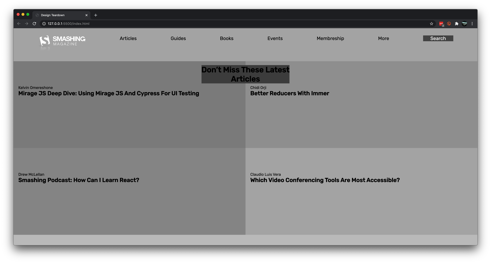

# Design Teardown - Smashing Magazine

> A clone of the article page of the New York Times.

This project demonstrates heatmap of the Smashing Magazine

## Built With

- HTML
- CSS

## Live Demo

[Live Demo Link](https://nostalgic-curie-b81273.netlify.app/)

## Getting Started

To get a local copy up and running download the repository and open the index.html file with a browser of your choice.

## Authors

👤 **Mohammad Umar**

- Github: [@mohammadumar28](https://github.com/mohammadumar28)

👤 **Razika**

- Github: [@rahalrazika](https://github.com/rahalrazika)

## 🤝 Contributing

Contributions, issues and feature requests are welcome!

Feel free to check the [issues page](issues/).

## Show your support

Give a ⭐️ if you like this project!

## Acknowledgments

- Smashing Magazine
- The Odin Project

## 📝 License

This project is [MIT](lic.url) licensed.